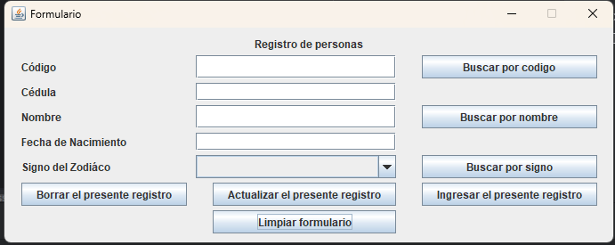

# Correccion de la Prueba con Conexión a SQL Server

## Integrante:
- Melany Sangucho
- Bryan Delgado

## Conceptualización del tema
La conexión a SQL Server es un tanto especial, pues, se necesita de una serie de configuraciones para acceder a la base de datos. Estas configuraciones se realizan para dar acceso
al programador a SQL Server por un puerto en específico, el 1433. Este debe concederse como permiso necesario o regla de entrada dentro del Firewall de Windows y dentro del SQL Server Configure Managment.
- **Configuración de Firewall de Windows**

## Creación de nuevo usuario
Dado que SQL Server permite el acceso total a la administración de la DB solamente al usuario que contiene Windows como master, se debe crear un nuevo usuario, al cual se le van a agregar permisos de manipulación y visualización de la base creada.
- **Creación usuario y contraseña "prueba"**

- **Configuración del usuario "prueba"**

## Configuración de IntelliJ para acceso a SQL Server
- **Instalación del JDBC de SQL Server para el IDE**

- **Acceso a la conexión por la pestaña DataBase y aceptación de conexión**

- **Verificación de la tabla de datos PERSONAS en la base de datos**

- **Modificación del DB URL para acceso a la base de datos**  
Dado que SQL Server es estrcito en cuanto a las conexiones que se realicen hacia su entorno, la URL que conece la dirección de la base de datos debe agregar los parámetros de certificación de servidor y de encriptación, pues, SQL Server encripta estos mismos para mayor seguridad.

***
## Realización de Búsqueda y CRUD con SQL Server
Para realizar este CRUD, se van a tomar datos ingresador a la base, se ingresarán nuevos datos o se eliminara. También se realizará las buscqueda de estos por medio de items específicos ya obtenidos.

- **Limpiar Formulario**  
  

### CRUD
- **Buscar Registro**
  - **Buscar por Código**  
  
  - **Buscar por Signo**  
  
  - **Persona no encontrada**  
  
- **Ingresar Registro**
  - **Registro Nuevo**  
    
  - **Evidencia en tabla de nuevo registro**  
    
- **Actualizar Registro**
  - **Dato Modificado**  
    
  - **Evidencia en tabla de datos**  
    
- **Borrar Regitro**
  - **Registro a Borrar**  
     
  - **Evidencia en tabla**  
     
  - **Persona no encontrada tras eliminación**  
     
